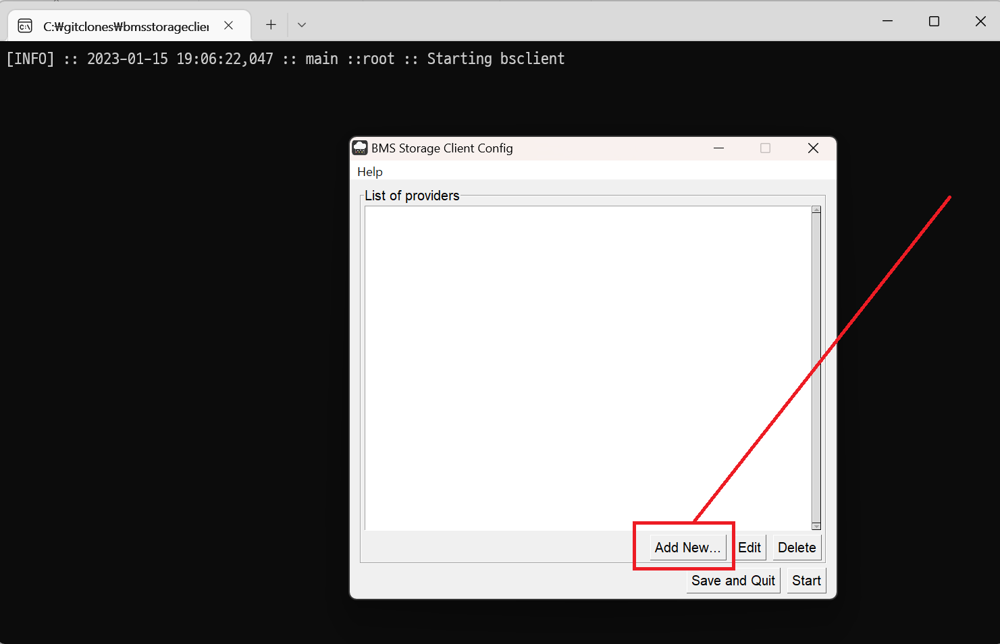
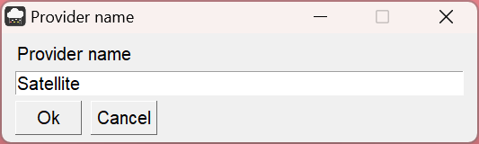
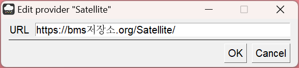
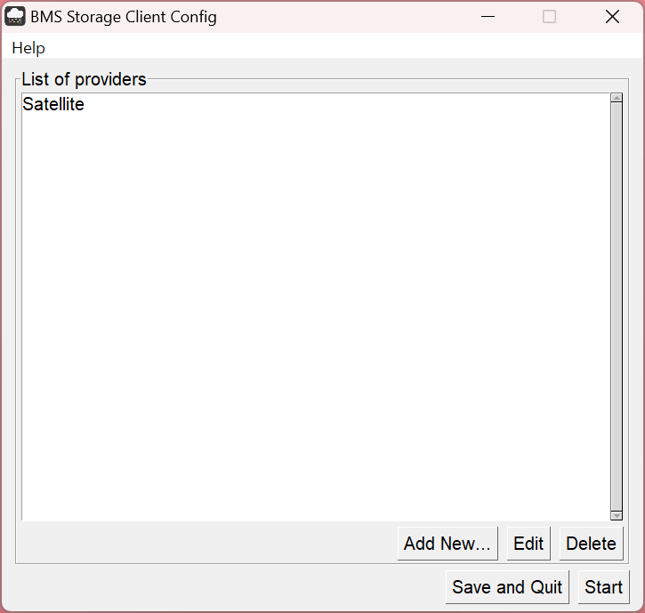
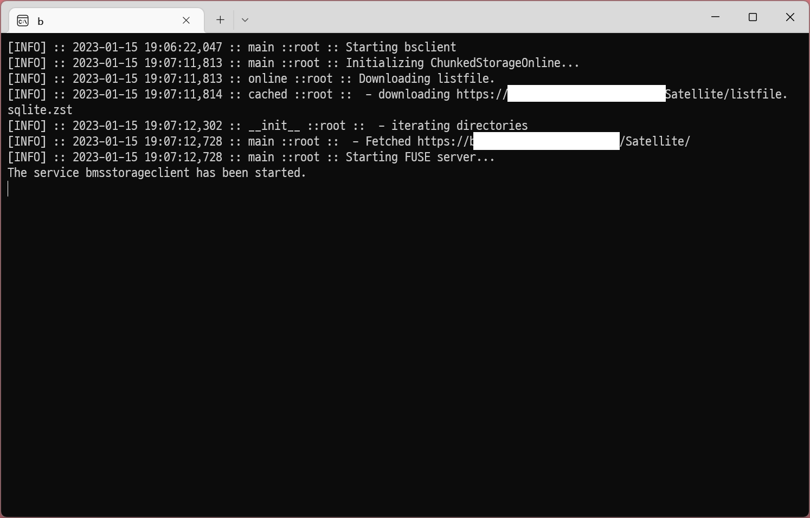
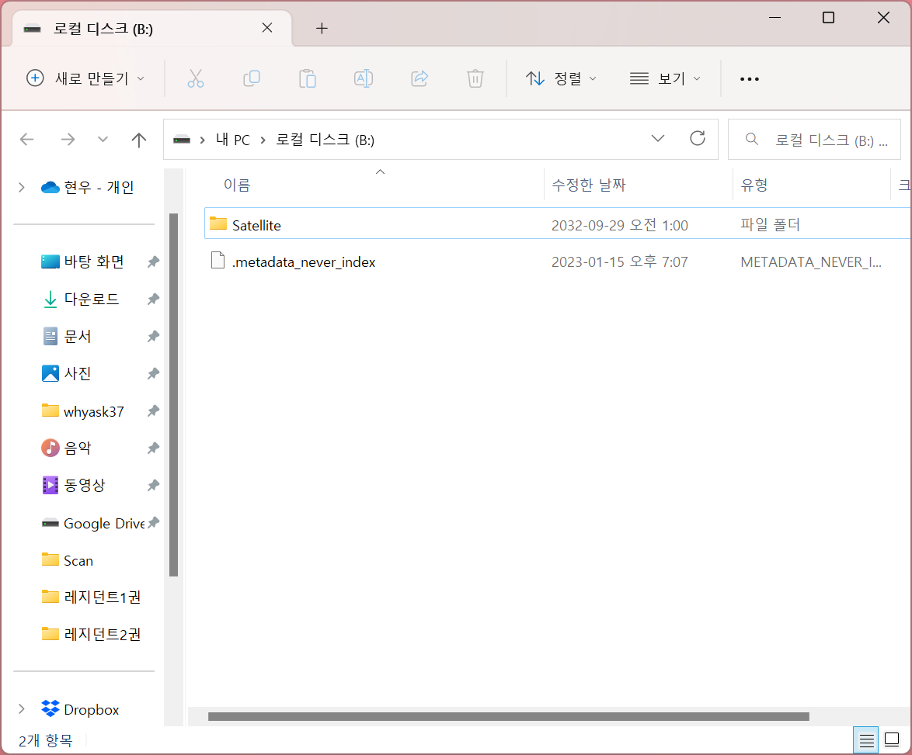
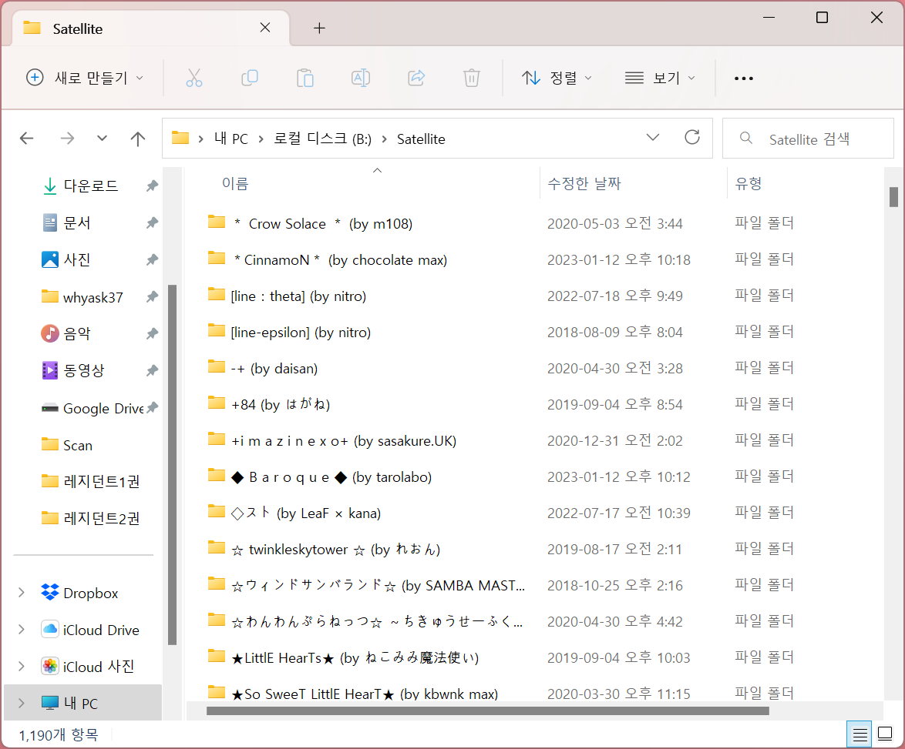

# BMS Storage Server - Server & Client

본 페이지는 BMS 파일을 클라우드에 호스팅하는 방법을 설명합니다.

> Beatoraja용으로 만들었고, 일단 LR2랑 호환성은 확인되지 않았습니다.

## 접속기(bmsstorageclient) 사용방법


1. 먼저 WinFSP 설치가 필요합니다. [WinFSP 홈페이지](https://winfsp.dev/rel/)
2. [bmsstorageclient.zip](./bmsstorageclient.zip) 압축을 풀어서 .exe 파일을 실행시키면 다음과 같이 나옵니다. 
3. "Add new..." 버튼을 누르면 이런 화면이 나옵니다. 적당히 클라우드 이름을 적어줍시다. 
4. "OK"를 누르면 이런 화면이 나옵니다. 서버 URL을 적어줍시다. 
   > 서버 호스팅 방법은 밑에 참고하세요. 보통 이 글을 읽으시는 분들은 다른 사람이 올려둔 서버를 쓰시겠죠?
5. "OK" 를 누르면 클라우드 서버가 등록됩니다. 
6. "Start"를 누르면 밑에 검은 콘솔창이 동작합니다. 
7. `The service bmsstorageclient has been started.` 문구가 뜨면 `B:\` 드라이브로 가봅시다. 
8. (2) 과정에서 설정했던 클라우드 이름으로 폴더가 있을겁니다. 들어가보면 BMS 폴더들이 안에 있을겁니다. 
9.  이제 `B:\Satellite` 폴더를 beatoraja에 넣으면 됩니다. LR2랑 호환성은 확인되지 않았습니다.

----

## 서버 운영

> BMS 플레이어 분들은 밑에 읽지 않으셔도 됩니다.

BMS는 파일 갯수가 너무 많아서, 이것을 좀 줄여줄 필요가 있습니다. 파일 여러개를 합쳐주는 툴을 설치합시다.

- [Node.js](https://nodejs.org/download/)를 설치합니다. 서버 프로그램은 Node.js 18 버젼에서 테스트되었습니다.
- 다음 명령어로 bmspack을 설치합니다.

  ```sh
  npm i -g @bmsstorageserver/bmspack
  ```

- `bmspack` 명령어가 설치되었습니다.

이제 이 명령어를 사용할겁니다. 먼저, BMS 파일들이 모여있는 폴더로 가봅시다. 예를 들어 `D:\BMS\Satellite` 에 이런 식으로 여러 BMS 파일들이 들어있다고 해봅시다.

```
D:\Satellite
  ㄴ sl0
      ㄴ 2anyFirst
          ㄴ 키음.ogg
          ㄴ BGA.mp4
          ㄴ another.bms
  ㄴ sl1
  ㄴ sl2
  ㄴ sl3
  ㄴ sl4
  ㄴ sl5
  ㄴ sl6
  ㄴ sl7
  ㄴ sl8
  ㄴ sl9
  ㄴ sl10
  ㄴ sl11
  ㄴ sl12
```

`Satellite` 폴더에는 아마 수십~수백만개의 파일이 들어있을겁니다. 이들을 합쳐봅시다. 합쳐질 폴더 `D:\BMSPAK\Satellite` 폴더를 만들어줍니다. 그 다음,

```sh
$ cd D:\
$ bmspack satellite.cfg
Modify satellite.cfg and retry
```

위와 같이 하면 `D:\satellite.cfg` 파일이 생성될겁니다. 이 파일을 다음과 같이 수정합니다.

```json
{
  "inputRoot": "D:\\Satellite",
  "outputRoot": "D:\\BMSPAK\\Satellite",
  "chunkedStorageOptions": {
    "chunkFileThreshold": 1440 * 1024,
    "soloFileThreshold": 5 * 1024 * 1024
  }
}
```

각 변수들의 역할은 다음과 같습니다.

- `inputRoot`: BMS 파일들이 들어있는 폴더. `\`는 `\\` 같이 두번 적어야합니다.
- `outputRoot`: 합친 결과물이 출력될 곳. `\`는 `\\` 같이 두번 적어야합니다.
- 나머지는 몰라도 됩니다.

> [설명] chunkFileThreshold: 각 chunk 파일크기 대략적 제한, soloFileThreshold: BGA같이 어느정도 용량이 큰 파일들은 chunk 하나를 배당하는데, 그 "큰 파일"의 크기 기준.

```sh
$ bmspack satellite.cfg
1. Collecting files... \
```

와 같이 `bmspack`을 다시 실행시키면 .bms 파일들이 `D:\BMSPAK\Satellite` 폴더에 합쳐집니다. 이 과정은 아마 꽤 걸릴겁니다.

> 참고) 다음 확장명의 파일들만 BMSPAK에 합쳐집니다.
>
> - BMS: bmx, bms, bme, bml, bmson
> - 그림: jpg, jpeg, gif, bmp, png, tga
> - 음악/키음: wav, ogg, flac, mp3
> - BGA: mp4, wmv, m4v, webm, mpg, mpeg, m1v, m2v, avi


합치는 과정이 끝난 다음 `D:\BMSPAK\Satellite\` 폴더를 확인해보면

- listfile.sqlite
- 여러 *.chunks 파일들

이 있을겁니다. 이제 이것을 nginx/S3 등 아무 수단이나 사용해서 본인 웹 서버에 올리시면 됩니다.

ex) https://example.com/BMSPAK/listfile.sqlite 처럼 접근 가능하면 됩니다.

