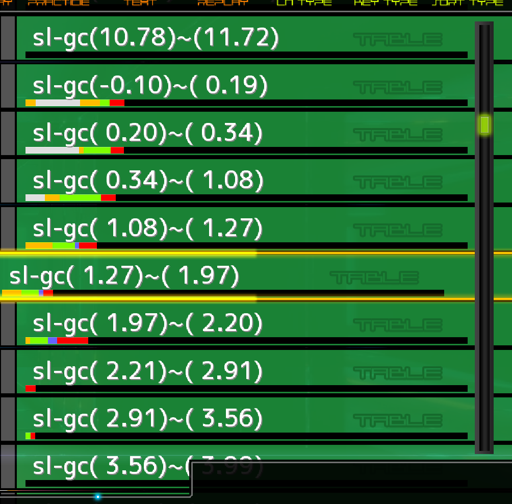

# Unofficial Stella/Satellite Difficulty Prediction-Based Table

[한국어](./index.html) | [English](./index.en.html)

This is a derived difficulty table that reorganizes songs from [Stella](https://stellabms.xyz/recommend/st)/[Satellite](https://stellabms.xyz/recommend/sl) based on estimated song difficulty.

> The creator of this derived difficulty table is not affiliated with the creators of Stella/Satellite. This table was created with permission from the original difficulty table creators. Please use the [original difficulty table](https://stellabms.xyz/) site for adding or removing songs.

The song difficulties are estimated using LR2IR data, so they represent the difficulty when played with an LR2 gauge.

## Difficulty Table

- **Satellite**
  - [Estimated Easy Gauge Difficulty Table](./table-sl-ec.html)
  - [Estimated Groove Gauge Difficulty Table](./table-sl-gc.html)
  - [Estimated Hard Gauge Difficulty Table](./table-sl-hc.html)
  - [Estimated Full Combo Difficulty Table](./table-sl-fc.html)

- **Stella**
  - [Estimated Easy Gauge Difficulty Table](./table-st-ec.html)
  - [Estimated Groove Gauge Difficulty Table](./table-st-gc.html)
  - [Estimated Hard Gauge Difficulty Table](./table-st-hc.html)
  - [Estimated Full Combo Difficulty Table](./table-st-fc.html)

## Explanation

1. All songs from Satellite/Stella are sorted by their estimated difficulty level for clear rates.
2. The songs are roughly divided into groups of 50 and assigned difficulty labels.
3. Songs without an estimated difficulty (e.g., due to insufficient play counts) are categorized as `(unclassified)`.

