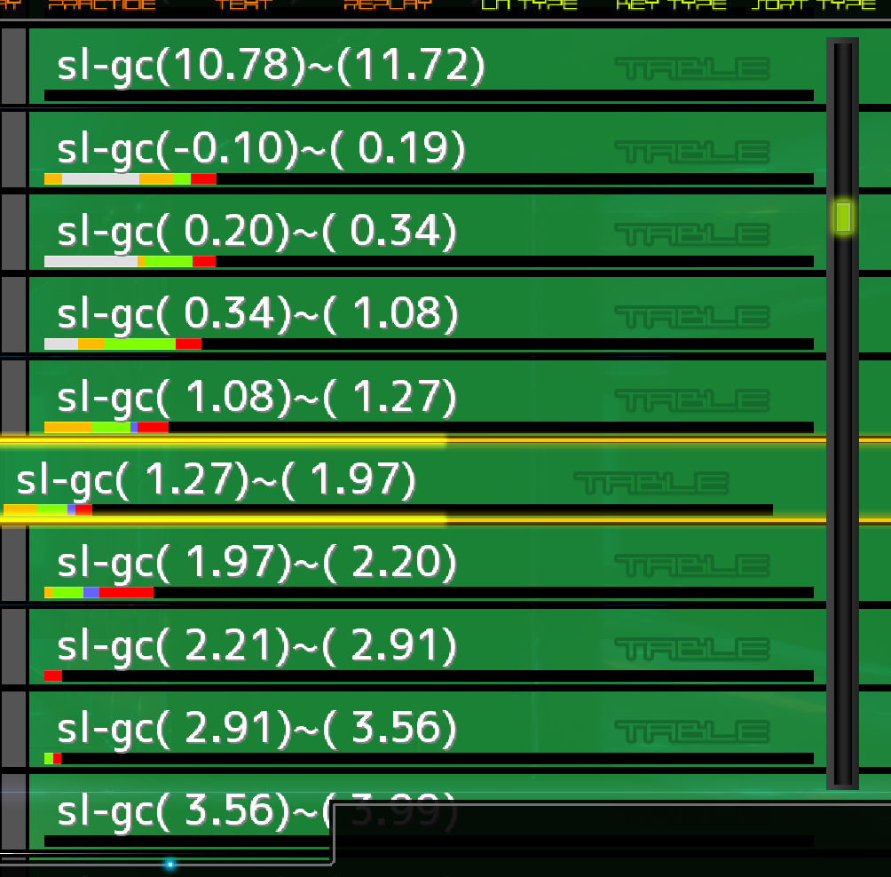

# Unofficial Stella/Satellite Difficulty Prediction-Based Table

[한국어](./index.html) | [English](./index.en.html)

This is a derived difficulty table that reorganizes songs from [Stella/Satellite](https://stellabms.xyz/), based on song difficulty estimates by [HorieYuuka BMS Library Scale Analyzer](https://horieyuuka.github.io/Scale-analyzer).

> The creator of this derived difficulty table is not affiliated with the creators of Stella/Satellite. This table was created with permission from the original difficulty table creators. Please use the [original difficulty table](https://stellabms.xyz/) site for adding or removing songs.

This data is calculated by combining LR2IR / MinIR / Bokutachi data. You can think of the estimated difficulty as the difficulty when played at a level somewhere between the two gauges. Only the scale has been changed by linearly regressing the original estimated difficulty data range against the **Easy Clear** difficulty levels of Satellite and Stella respectively.

## Difficulty Table

- **Satellite**
  - [Estimated Easy Gauge Difficulty Table](./table-sl-ec.html)
  - [Estimated Hard Gauge Difficulty Table](./table-sl-hc.html)

- **Stella**
  - [Estimated Easy Gauge Difficulty Table](./table-st-ec.html)
  - [Estimated Hard Gauge Difficulty Table](./table-st-hc.html)

## Explanation

1. All songs from Satellite/Stella are sorted by their estimated difficulty level for clear rates.
2. The songs are roughly divided into groups of 50 and assigned difficulty labels.
3. Songs without an estimated difficulty (e.g., due to insufficient play counts) are categorized as `(unclassified)`.

