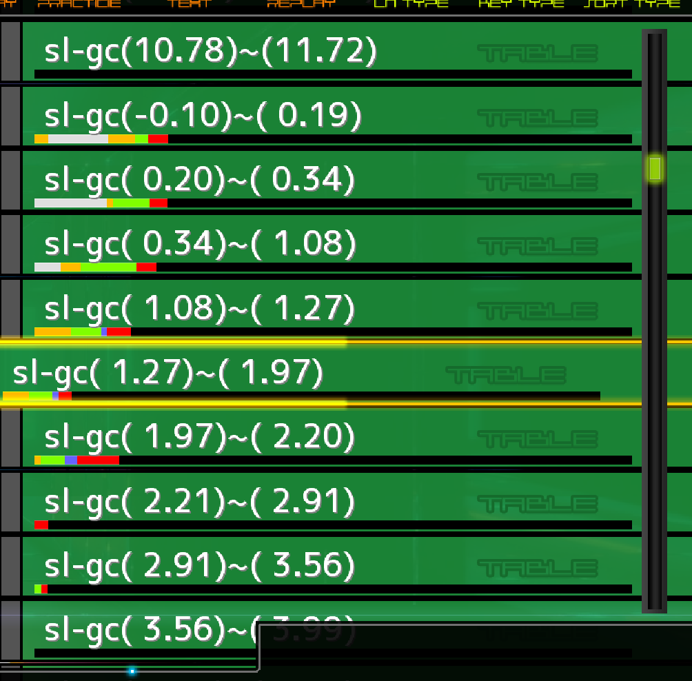

# 비공식 Stella/Satellite 난이도예측 기반 파생 난이도표

[스텔라](https://stellabms.xyz/recommend/st)/[새틀라이트](https://stellabms.xyz/recommend/sl)를 곡난이도 추정에 따라 재배열한 파생 난이도표입니다.

> 본 파생 난이도표 제작자는 스텔라/새틀라이트 제작자와 관련이 없습니다. 원 난이도표
> 제작자분의 허가를 얻어 제작한 파생 난이도표로, 곡 추가/제거는 [원본 난이도표](https://stellabms.xyz/)
> 사이트를 이용해주시기 바랍니다.

LR2IR 데이터로 추정된 곡난이도이므로, LR2 게이지로 플레이했을 때 난이도라고 생각해주시면 되겠습니다.

## 난이도표

- Satellite
  - [이지게이지 추정 곡난이도표](./table-sl-ec.html)
  - [그루브게이지 추정 곡난이도표](./table-sl-gc.html)
  - [하드게이지 추정 곡난이도표](./table-sl-hc.html)
  - [풀콤보 추정 곡난이도표](./table-sl-fc.html)

- Stella
  - [이지게이지 추정 곡난이도표](./table-st-ec.html)
  - [그루브게이지 추정 곡난이도표](./table-st-gc.html)
  - [하드게이지 추정 곡난이도표](./table-st-hc.html)
  - [풀콤모 추정 곡난이도표](./table-st-fc.html)

## 설명

1. 새틀라이트/스텔라 전곡을 추정 난이도표의 클리어레벨로 정렬합니다.
2. 대강 50개씩 나눠서 난이도명을 부여합니다.
3. 아직 추정난이도가 정해지지 않은 곡 (플레이카운트가 너무 적은 등) 은 `(unclassified)` 로 분류합니다.

